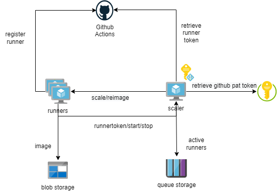

# vmss-github-runner
This is an experimental implementation of github runners on Azure VMSS. Basic features:

- Automatically builds lastest Ubuntu 20.04 Github Actions Virtual Images image
- Creates a VM scale with Managed Identity with `ephemeral` runners
- Create a single (so non-redundant) VM running the autoscaler
- Can run completely inside private vnet without inbound connectivity requirements

# How it works
The following diagram provides an overview of components and their relationships:

| Component | Type | Description|
|-----------|------|------------|
| Scaler    | Virtual Machine (VM) | Small python app doing handling the scaling logic |
| Runners   | Virtual Machine Scale Set (VMSS) | Github Actions Runners using Ubuntu 20.04 Github Actions Virtual Images image |
| KeyVault  | Azure Keyvault | Holds the Github PAT token needed to obtain a runner registration token |
| Image Storage | Premium Blob | Storage for the Github Runner images |
| Storage Queue | Storage V2 | Queue Storage used to store list of active runners |

When a Git Hub Runner instance is created a Github Runner token is retrieved from the Scaler component and the runner is registered as ephemeral runner. When a job is started on a runner an additional `Set up runner` and `Complete runner` steps are inserted at the begin and end to the workflow.
During the `Set up runner` step the runner registers the job start at the scaler. The scaler registers that the runner is busy by inserting a message in the storage queue. The scaler also evaluates how busy the pool is and decides whether or not to pro-actively scale up additional runners.
During the `Complete runner` step the runner registers the job end and the scaler. The scaler registers that the runner is done by removeing the message it created earlier from the storage queue. The scaler also evaluates how busy the pool is and based on that decides either to re-image the runner or to delete it.

# Security
The scaler VM has a managed identity with the following role assignments (can probably be made more least privileged):

- `Reader` role on the resource group the scaler and vm scale set reside in
- `Network Contributor` role on the resource group containing the Vnet so it can joing new VMSS instances.
- `Virtual Machine Contributor` role on the VMSS in order to scale and re-image VMSS instances.
- `Contributor` role on the Storage Queues.

# Workflow parameters

| Parameter | Type | Description|
|-----------|------|------------|
|build-image| boolean | Switch to indicate if virtual actions image should be rebuild (takes approximately 2 hours)|
|vmss-runner-name| string | Name of the VMSS used for runners|
|vmss-scaler-name| string | Name of the VM used for scaler|
|github-repo| string | Github repo name the runners should be registered at (need to look into how to do the same at org level)| 
|runner-labels| string | Comma separated list of labels to put on the runners|
|pool-min-instances| number | Minimum number of runners to maintain (must be > 0)|
|pool-max-instances| number | Maximum number of runners |
|pool-free-target-percentage| number | Percentage of active runner count that the scale set should try to maintain as available|

# Secrets
| Secret | Description|
|--------|------------|
|AZURE_CREDENTIALS| Azure credentials to use |
|RUNNER_PAT| Github PAT token to register runners| 
|VMSS_PASSWORD| Password set on runners, to be replaces by SSH key|
|VMSS_USER| Username created on the runners |

# Todo
- Error handling (now only happy flow is handled).
- Further reduce role assignments to LP.
- Logging/Monitoring.
- Add keyvault creation
- Use SSH keys for VM and VMSS
- clean up